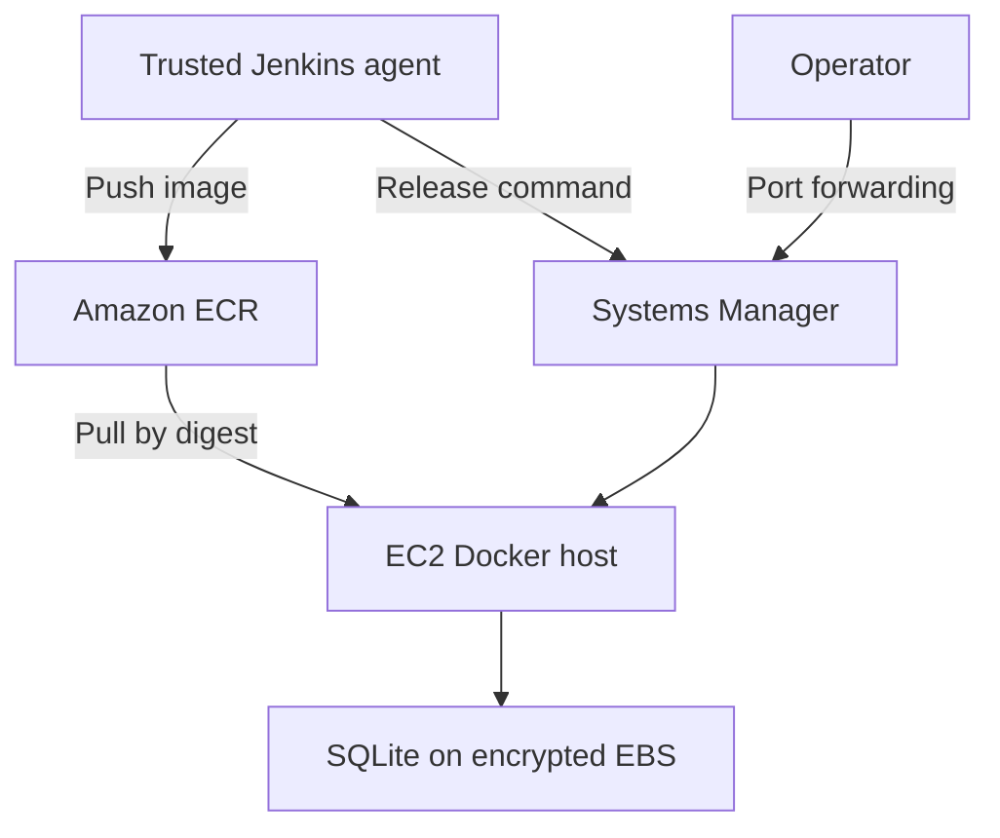

# Incident platform — Terraform AWS infrastructure

Provisions an isolated VPC, one subnet, EC2, an immutable-tag ECR repository,
instance identity and Systems Manager access for the incident API.
Maintainer: Omprakash Kasaraneni.

**Status:** Terraform initialization, planning and deployment completed.
All 12 resources were created. Systems Manager connectivity and Docker host
readiness were verified. Application deployment and cleanup remain pending.

## Architecture



Public IPv4 supplies outbound access without a NAT gateway. The security group
has no ingress rules, and the container binds only to host loopback. The API
is reached through an authenticated SSM tunnel. No SSH key is required.

## Provision

Requires Terraform 1.6+, AWS CLI v2, Session Manager plugin and an AWS identity
permitted to manage these resources. Use AWS SSO or another short-lived login;
never place credentials in tfvars. The EC2 AMI is x86_64; keep an x86 instance type.

```bash
aws sts get-caller-identity
cp terraform.tfvars.example terraform.tfvars
terraform init
terraform fmt -check
terraform validate
terraform plan -out=tfplan
terraform apply tfplan
terraform output
```

Review the plan and costs before apply. Commit the generated
`.terraform.lock.hcl` after successful initialization. Never commit state,
saved plans or credentials. Local state is intentional for this single-operator
first version; remote state/locking must precede shared Terraform execution.

## Readiness and deployment

Wait for the instance to appear Online in Systems Manager. In an SSM shell:
```bash
sudo test -f /var/lib/incident-host-ready
sudo docker info
```
If absent, inspect `/var/log/cloud-init-output.log`. A managed instance can be
online before user-data finishes. Pass `region`, `instance_id` and `ecr_url`
outputs to the Jenkins project only once the host is ready.

After Jenkins deploys, set INSTANCE_ID to the output value and run:
```bash
aws ssm start-session --region us-east-1 --target "$INSTANCE_ID" --document-name AWS-StartPortForwardingSession --parameters '{"portNumber":["8080"],"localPortNumber":["8080"]}'
```
Keep the tunnel open; in another terminal run the Docker project's smoke script.
Change region if you changed the variable. The session operator needs SSM
session permissions independently of the EC2 instance role.

## Tradeoffs and future work

One host means deployment downtime and no high availability. Container storage
survives container replacement, but EC2 replacement or destroy deletes the root
volume and incidents. The latest-AMI parameter can cause a replacement in a later
plan: inspect replacements and back up first. Automated backups, PostgreSQL,
private-subnet deployment, remote state, reusable modules and monitored alerts
are next milestones. None are claimed as implemented.

EC2, EBS, public IPv4 and ECR may incur charges. This design creates no NAT
gateway or load balancer. Set a budget alert in your account and destroy the
demo when finished; no free-tier assumption is made.

## Cleanup

Back up needed incidents first. Delete only this project's image versions in
its ECR repository (the repository intentionally refuses deletion while nonempty).
Then review `terraform plan -destroy`, run `terraform destroy`, and confirm the
named EC2 instance, volumes, repository and VPC are gone. Keep state until the
cleanup succeeds. Do not use account-wide deletion commands.

## Evidence

Save a redacted plan, no-ingress security group, successful SSM session, ECR
image digest, health response and completed destroy result. See docs/validation.md.
